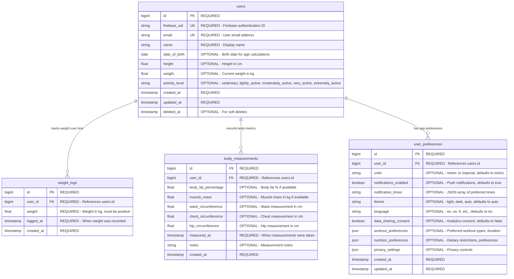

```mermaid
erDiagram
    users {
        bigint id PK "REQUIRED"
        string firebase_uid UK "REQUIRED - Firebase authentication ID"
        string email UK "REQUIRED - User email address"
        string name "REQUIRED - Display name"
        date date_of_birth "OPTIONAL - Birth date for age calculations"
        float height "OPTIONAL - Height in cm"
        float weight "OPTIONAL - Current weight in kg"
        string activity_level "OPTIONAL - sedentary, lightly_active, moderately_active, very_active, extremely_active"
        timestamp created_at "REQUIRED"
        timestamp updated_at "REQUIRED"
        timestamp deleted_at "OPTIONAL - For soft deletes"
    }
    
    weight_logs {
        bigint id PK "REQUIRED"
        bigint user_id FK "REQUIRED - References users.id"
        float weight "REQUIRED - Weight in kg, must be positive"
        timestamp logged_at "REQUIRED - When weight was recorded"
        timestamp created_at "REQUIRED"
    }
    
    body_measurements {
        bigint id PK "REQUIRED"
        bigint user_id FK "REQUIRED - References users.id"
        float body_fat_percentage "OPTIONAL - Body fat % if available"
        float muscle_mass "OPTIONAL - Muscle mass in kg if available"
        float waist_circumference "OPTIONAL - Waist measurement in cm"
        float chest_circumference "OPTIONAL - Chest measurement in cm"
        float hip_circumference "OPTIONAL - Hip measurement in cm"
        timestamp measured_at "REQUIRED - When measurements were taken"
        string notes "OPTIONAL - Measurement notes"
        timestamp created_at "REQUIRED"
    }
    
    user_preferences {
        bigint id PK "REQUIRED"
        bigint user_id FK "REQUIRED - References users.id"
        string units "OPTIONAL - metric or imperial, defaults to metric"
        boolean notifications_enabled "OPTIONAL - Push notifications, defaults to true"
        string notification_times "OPTIONAL - JSON array of preferred times"
        string theme "OPTIONAL - light, dark, auto, defaults to auto"
        string language "OPTIONAL - en, es, fr, etc., defaults to en"
        boolean data_sharing_consent "OPTIONAL - Analytics consent, defaults to false"
        json workout_preferences "OPTIONAL - Preferred workout types, duration"
        json nutrition_preferences "OPTIONAL - Dietary restrictions, preferences"
        json privacy_settings "OPTIONAL - Privacy controls"
        timestamp created_at "REQUIRED"
        timestamp updated_at "REQUIRED"
    }

    %% Relationships
    users ||--o{ weight_logs : "tracks weight over time"
    users ||--o{ body_measurements : "records body metrics"
    users ||--o{ user_preferences : "has app preferences"
```