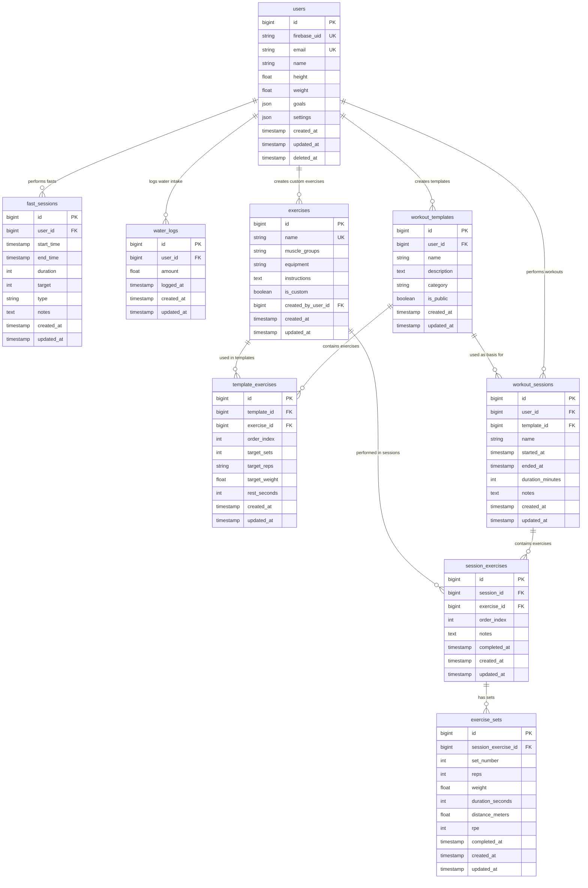

# Tracker - Database Schema

## Tables

### Fasting

#### users
| Field | Type | Key | Description |
|-------|------|-----|-------------|
| id | BIGINT | PK | User ID |
| email | VARCHAR(255) | UNIQUE | User email |
| name | VARCHAR(255) | | User display name |
| timezone | VARCHAR(50) | | User timezone |
| created_at | TIMESTAMP | | Account creation |

#### fasting_types
| Field | Type | Key | Description |
|-------|------|-----|-------------|
| id | INT | PK | Type ID |
| name | VARCHAR(50) | UNIQUE | Internal name (16_8, 18_6, etc.) |
| display_name | VARCHAR(100) | | User-friendly name |
| fasting_hours | INT | | Hours of fasting (NULL for custom) |
| eating_hours | INT | | Hours of eating window (NULL for custom) |
| description | TEXT | | Type description |
| is_active | BOOLEAN | | Whether type is available |

#### fasting_sessions
| Field | Type | Key | Description |
|-------|------|-----|-------------|
| id | BIGINT | PK | Session ID |
| user_id | BIGINT | FK | References users.id |
| fasting_type_id | INT | FK | References fasting_types.id |
| started_at | TIMESTAMP | | Fast start time |
| ended_at | TIMESTAMP | | Fast end time |
| target_hours | DECIMAL(4,2) | | Planned fast duration |
| actual_hours | DECIMAL(4,2) | | Actual fast duration |
| is_completed | BOOLEAN | | Whether fast was completed successfully |
| notes | TEXT | | User notes |
| created_at | TIMESTAMP | | Record creation |

## Relationships
- users → fasting_sessions (1:many)
- fasting_types → fasting_sessions (1:many)

##

## Updates to be made

Below is a concise, POC-ready checklist. Tackle items in order; each item is small, testable, and expandable later.

### 11) Testing (repeatable)
- [ ] Postman environment with variables: `WEB_API_KEY`, `REFRESH_TOKEN`, `ID_TOKEN`
- [ ] Add “Refresh Token” request (Google Secure Token API) and test script to set `{{ID_TOKEN}}`
- [ ] Use `Authorization: Bearer {{ID_TOKEN}}` on protected requests

Quick test suite:
- Users: `GET /api/auth/me`, `PUT /api/auth/me`, `PATCH /api/auth/me/settings`
- Fasting: `GET /api/fasts/history`, `POST /api/fasts/`
- Water: `POST /api/water/`, `GET /api/water/`, `DELETE /api/water/latest`

# Diagram

