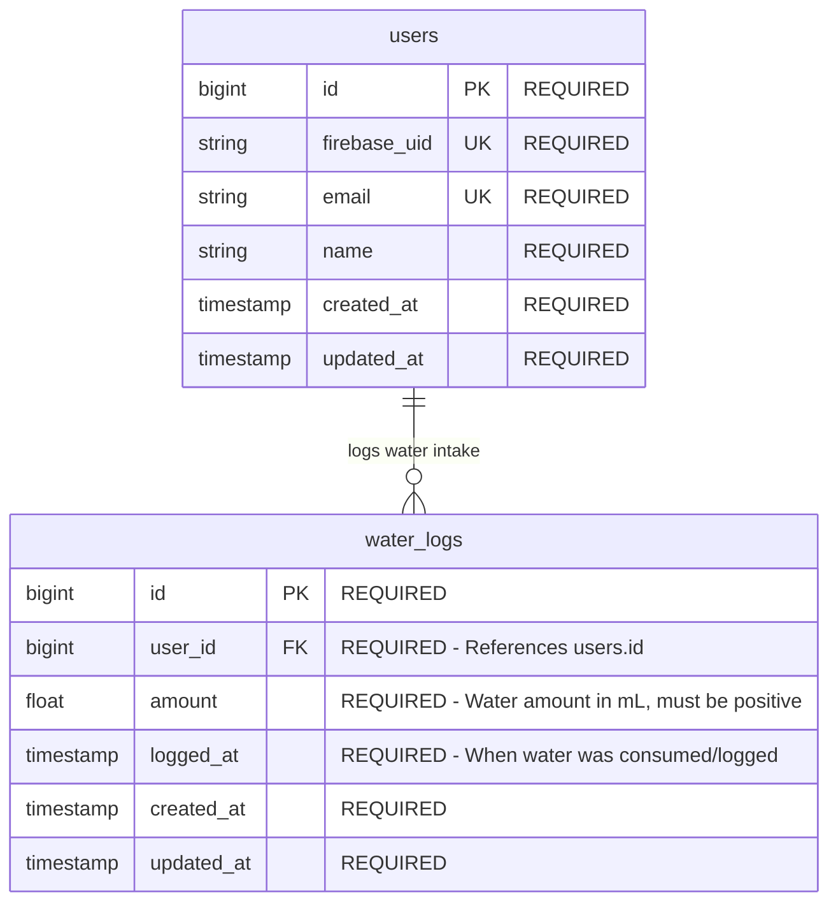

```mermaid
erDiagram
    users {
        bigint id PK "REQUIRED"
        string firebase_uid UK "REQUIRED"
        string email UK "REQUIRED"
        string name "REQUIRED"
        timestamp created_at "REQUIRED"
        timestamp updated_at "REQUIRED"
    }
    
    water_logs {
        bigint id PK "REQUIRED"
        bigint user_id FK "REQUIRED - References users.id"
        float amount "REQUIRED - Water amount in mL, must be positive"
        timestamp logged_at "REQUIRED - When water was consumed/logged"
        timestamp created_at "REQUIRED"
        timestamp updated_at "REQUIRED"
    }

    %% Relationships
    users ||--o{ water_logs : "logs water intake"
```