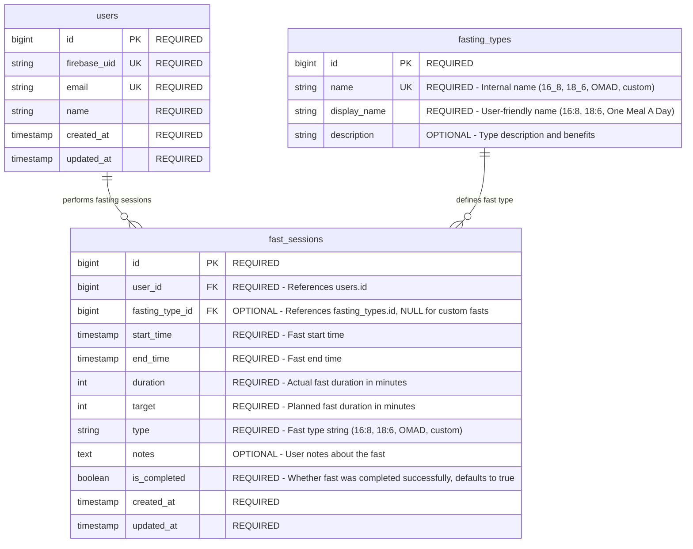

```mermaid
erDiagram
    users {
        bigint id PK "REQUIRED"
        string firebase_uid UK "REQUIRED"
        string email UK "REQUIRED"
        string name "REQUIRED"
        timestamp created_at "REQUIRED"
        timestamp updated_at "REQUIRED"
    }
    
    fasting_types {
        bigint id PK "REQUIRED"
        string name UK "REQUIRED - Internal name (16_8, 18_6, OMAD, custom)"
        string display_name "REQUIRED - User-friendly name (16:8, 18:6, One Meal A Day)"
        string description "OPTIONAL - Type description and benefits"
    }
    
    fast_sessions {
        bigint id PK "REQUIRED"
        bigint user_id FK "REQUIRED - References users.id"
        bigint fasting_type_id FK "OPTIONAL - References fasting_types.id, NULL for custom fasts"
        timestamp start_time "REQUIRED - Fast start time"
        timestamp end_time "REQUIRED - Fast end time"
        int duration "REQUIRED - Actual fast duration in minutes"
        int target "REQUIRED - Planned fast duration in minutes"
        string type "REQUIRED - Fast type string (16:8, 18:6, OMAD, custom)"
        text notes "OPTIONAL - User notes about the fast"
        boolean is_completed "REQUIRED - Whether fast was completed successfully, defaults to true"
        timestamp created_at "REQUIRED"
        timestamp updated_at "REQUIRED"
    }

    %% Relationships
    users ||--o{ fast_sessions : "performs fasting sessions"
    fasting_types ||--o{ fast_sessions : "defines fast type"
```