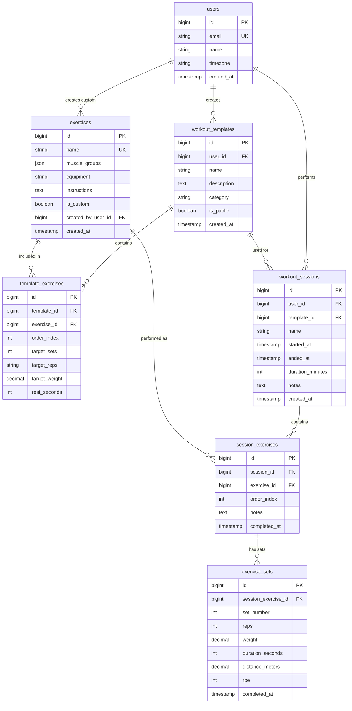

```mermaid
erDiagram
    users {
        bigint id PK
        string email UK
        string name
        string timezone
        timestamp created_at
    }
    
    exercises {
        bigint id PK
        string name UK
        json muscle_groups
        string equipment
        text instructions
        boolean is_custom
        bigint created_by_user_id FK
        timestamp created_at
    }
    
    workout_templates {
        bigint id PK
        bigint user_id FK
        string name
        text description
        string category
        boolean is_public
        timestamp created_at
    }
    
    template_exercises {
        bigint id PK
        bigint template_id FK
        bigint exercise_id FK
        int order_index
        int target_sets
        string target_reps
        decimal target_weight
        int rest_seconds
    }
    
    workout_sessions {
        bigint id PK
        bigint user_id FK
        bigint template_id FK
        string name
        timestamp started_at
        timestamp ended_at
        int duration_minutes
        text notes
        timestamp created_at
    }
    
    session_exercises {
        bigint id PK
        bigint session_id FK
        bigint exercise_id FK
        int order_index
        text notes
        timestamp completed_at
    }
    
    exercise_sets {
        bigint id PK
        bigint session_exercise_id FK
        int set_number
        int reps
        decimal weight
        int duration_seconds
        decimal distance_meters
        int rpe
        timestamp completed_at
    }
    
    %% Relationships
    users ||--o{ workout_templates : creates
    users ||--o{ workout_sessions : performs
    users ||--o{ exercises : "creates custom"
    
    workout_templates ||--o{ template_exercises : contains
    exercises ||--o{ template_exercises : "included in"
    
    workout_sessions ||--o{ session_exercises : contains
    exercises ||--o{ session_exercises : "performed as"
    
    session_exercises ||--o{ exercise_sets : "has sets"
    
    workout_templates ||--o{ workout_sessions : "used for"

```